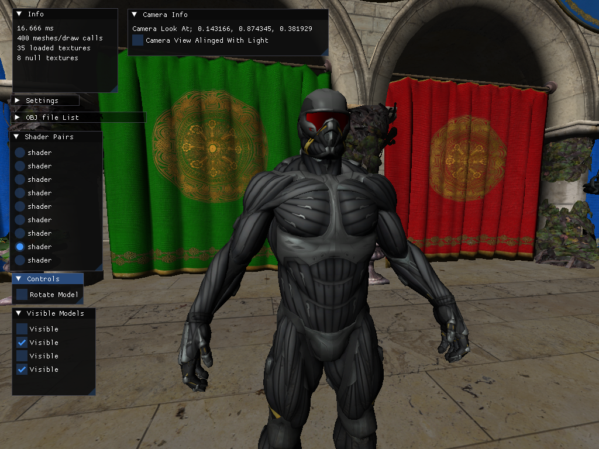
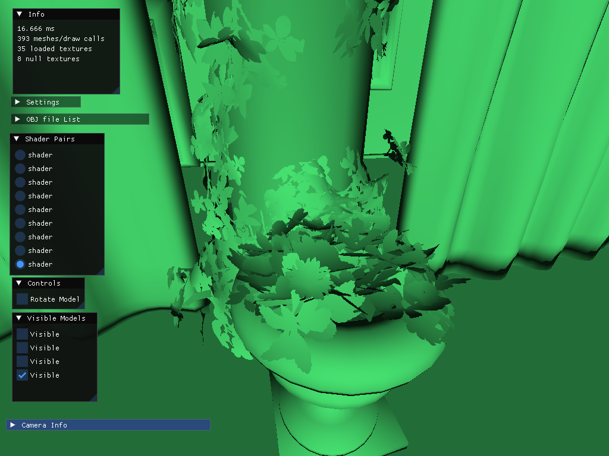

Basic real time 3D renderer using Win32, Direct3D 11 and HLSL in C/C++. Uses Dear ImGui, Assimp, nanosuit and sponza models by Crytek.

Features:
- Phong and Blinn-Phong shading models.
- Double sided shading avaible for meshes with no thickness such at leaves or chains

Screenshots:

